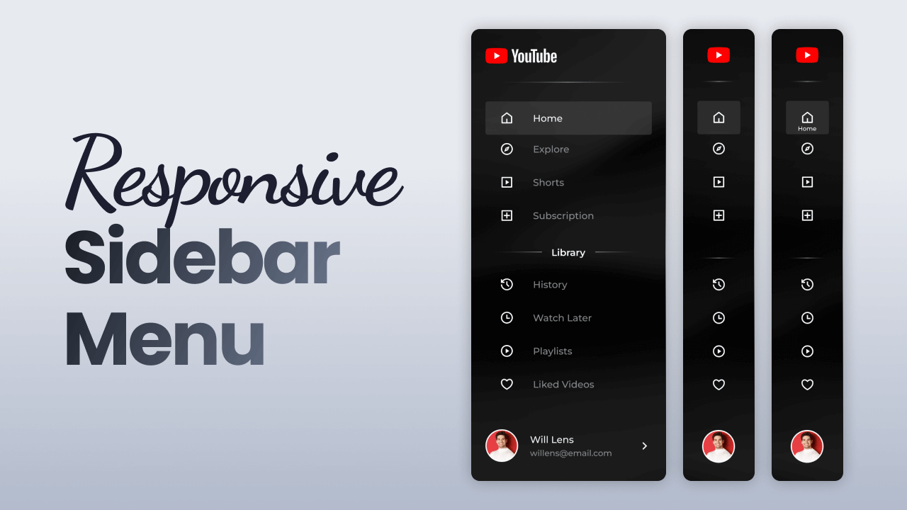

# Responsive Sidebar Menu

This project demonstrates a fully responsive sidebar menu that gracefully adapts across different screen sizes. Built without external frameworks, it offers a clean, lightweight, and intuitive interface that enhances website navigation.

**Live Website:** [https://kethnulee-weerasinghe.github.io/Responsive-Sidebar-Menu/](https://kethnulee-weerasinghe.github.io/Responsive-Sidebar-Menu/)



## Overview

This project implements a responsive sidebar menu that toggles open/closed, works nicely on desktop and mobile, and highlights active menu items as you navigate through content sections. It’s suitable for dashboards, single‑page apps, blog layouts, or any interface needing compact side navigation.

- Toggle button to expand / collapse sidebar  
- Highlight active menu item   
- Smooth transitions & animations  
- Responsive behavior: sidebar collapses or overlays on smaller screens  
- Clean, modern UI design
  
## Technologies

- HTML
- CSS
- JavaScript

## Running Locally

To view or edit the project locally:

```bash
git clone https://github.com/Kethnulee-Weerasinghe/Responsive-Sidebar-Menu.git
cd Responsive-Sidebar-Menu
